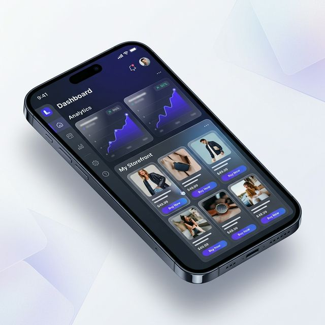

<div align="center">
  
  <h1>LinkStore</h1>
  <p><b>The #1 Link-in-Bio Storefront for Nigerian Social Media Merchants</b></p>
  
  [](https://nextjs.org/)
  [](https://tailwindcss.com/)
  [](https://clerk.dev/)
  [](https://paystack.com/)
</div>

---

## ✨ Overview

**LinkStore** helps Nigerian social media entrepreneurs turn their Instagram, WhatsApp, and TikTok presence into a professionalized commerce experience. Bridge the gap between "DM for price" and automated growth with a one-link store that handles everything from product display to automated payouts.



## 🚀 Key Features

- **⚡ One-Click Storefronts**: Create a professional, lightning-fast store URL for your social media bio in seconds.
- **💳 Automated Payouts**: Integrated with **Paystack Split Payments**. The system automatically handles your share and platform commissions (5.0%) without manual intervention.
- **🌙 Premium Adaptive UI**: A high-end design that automatically adjusts to **System Light & Dark Modes** for a professional look on any device.
- **📱 Mobile-First Dashboard**: Manage your inventory, track orders, and view deep analytics (Visits & Conversion clicks) directly from your smartphone.
- **🛡️ Enterprise Security**: Secure transactions and bank-grade data protection through Clerk and Paystack integrations.

## 🛠️ Tech Stack

- **Framework**: [Next.js 15 (App Router)](https://nextjs.org/)
- **Database**: [PostgreSQL](https://www.postgresql.org/) with [Prisma ORM](https://www.prisma.io/)
- **Authentication**: [Clerk](https://clerk.com/)
- **Payments**: [Paystack API](https://paystack.com/) (Subaccounts & Split Payments)
- **Styling**: [Tailwind CSS 4](https://tailwindcss.com/) & [Framer Motion](https://www.framer.com/motion/)
- **Media**: [Cloudinary](https://cloudinary.com/) (Image hosting)
- **Icons**: [Lucide React](https://lucide.dev/)

## ⚙️ Setup Instructions

### 1. Clone the repository
```bash
git clone https://github.com/yourusername/linkstore.git
cd linkstore
```

### 2. Install dependencies
```bash
npm install
```

### 3. Configure Environment Variables
Create a `.env` file in the root directory and add your credentials:
```env
# Database
DATABASE_URL="postgresql://..."

# Auth (Clerk)
NEXT_PUBLIC_CLERK_PUBLISHABLE_KEY=pk_...
CLERk_SECRET_KEY=sk_...

# Payments (Paystack)
PAYSTACK_PUBLIC_KEY=pk_...
PAYSTACK_SECRET_KEY=sk_...

# Media (Cloudinary)
NEXT_PUBLIC_CLOUDINARY_CLOUD_NAME=...
NEXT_PUBLIC_CLOUDINARY_UPLOAD_PRESET=...
```

### 4. Database Setup
```bash
npx prisma generate
npx prisma db push
```

### 5. Start Development Server
```bash
npm run dev
```

## 📈 Roadmap

- [x] Multi-tenant Storefront architecture.
- [x] Automated Split Payment settlement.
- [x] High-performance Bento Grid features UI.
- [x] System-wide Dark Mode.
- [ ] WhatsApp Order Notifications.
- [ ] Product Inventory Alerts.
- [ ] Advanced Customer Analytics.

---

<p align="center">
  Built with ❤️ for Nigerian Excellence by LinkStore Team.
</p>
